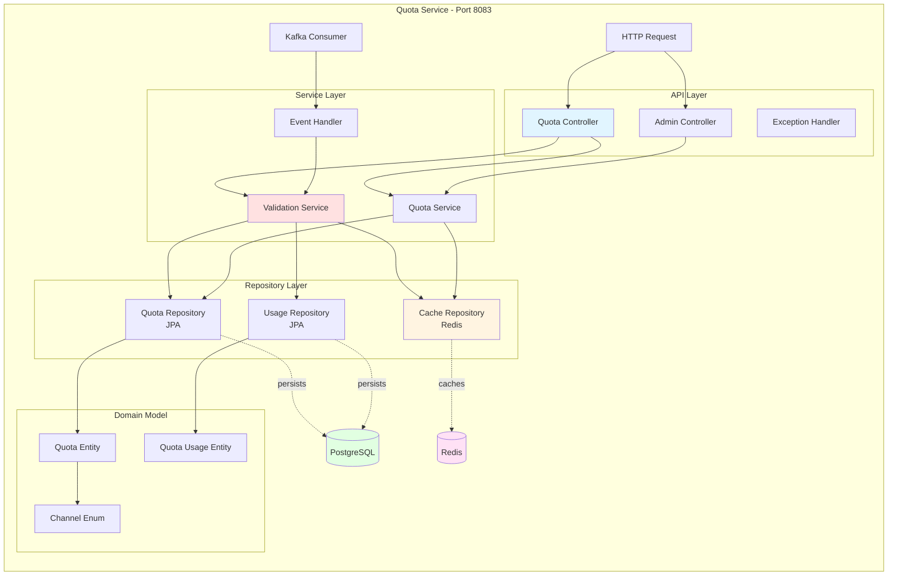

# Diagrama de Componentes - Sistema de Notificações

## Visão Geral do Sistema

---

## API Gateway - Componentes Detalhados

---

## Quota Service - Componentes Detalhados

---

## Fluxo de Validação de Quota (Componentes)

---

## Componentes por Camada

### 1. Presentation Layer (API)

---

### 2. Service Layer (Business Logic)

---

### 3. Data Layer (Persistence)

---

## Infraestrutura de Observabilidade

---

## Componentes de Resiliência

---

## Tecnologias por Componente

| Componente | Tecnologia | Versão | Propósito |
|------------|------------|--------|-----------|
| **API Gateway** | Spring Cloud Gateway | 4.1.6 | Roteamento reativo |
| **Autenticação** | JJWT | 0.12.6 | JWT tokens |
| **Circuit Breaker** | Resilience4j | 2.2.0 | Resiliência |
| **Quota Service** | Spring Boot | 3.5.7 | Microsserviço |
| **ORM** | Hibernate | 6.6.4 | Persistência |
| **Cache** | Redis | 7.4.5 | Cache distribuído |
| **Database** | PostgreSQL | 15 | Banco transacional |
| **Migrations** | Flyway | 10.23.2 | Versionamento schema |
| **Mensageria** | Kafka | 3.x | Eventos assíncronos |
| **Métricas** | Micrometer | 1.15.x | Observabilidade |
| **Tracing** | OpenTelemetry | 1.x | Rastreamento distribuído |

---

## Padrões de Design Aplicados

---

## Dependências entre Componentes
