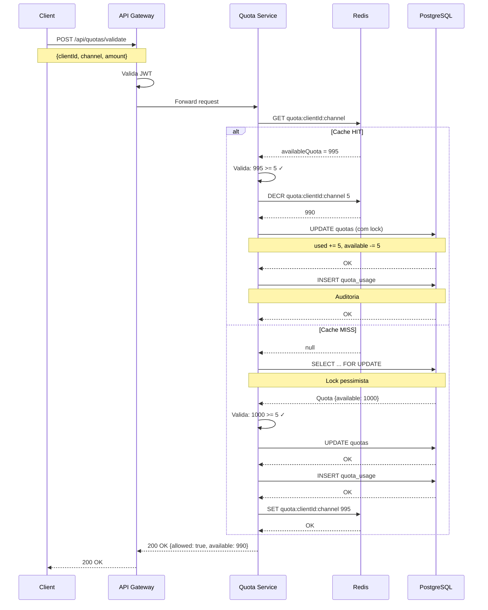
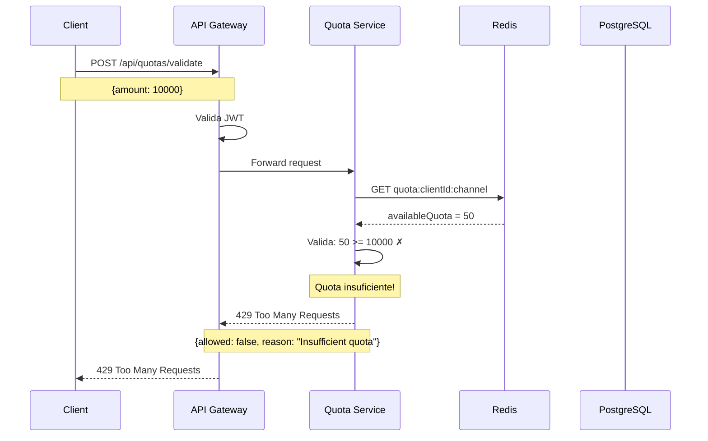
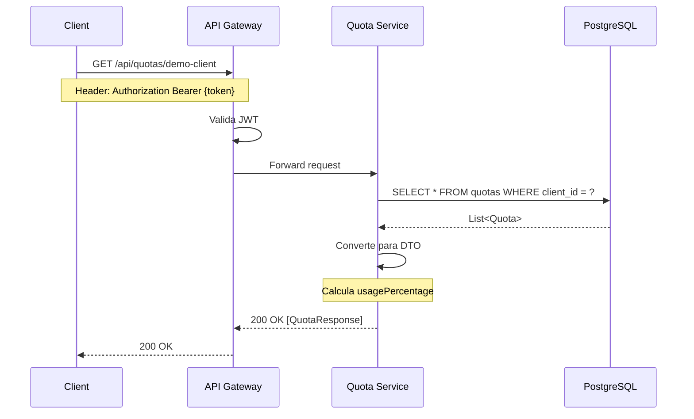
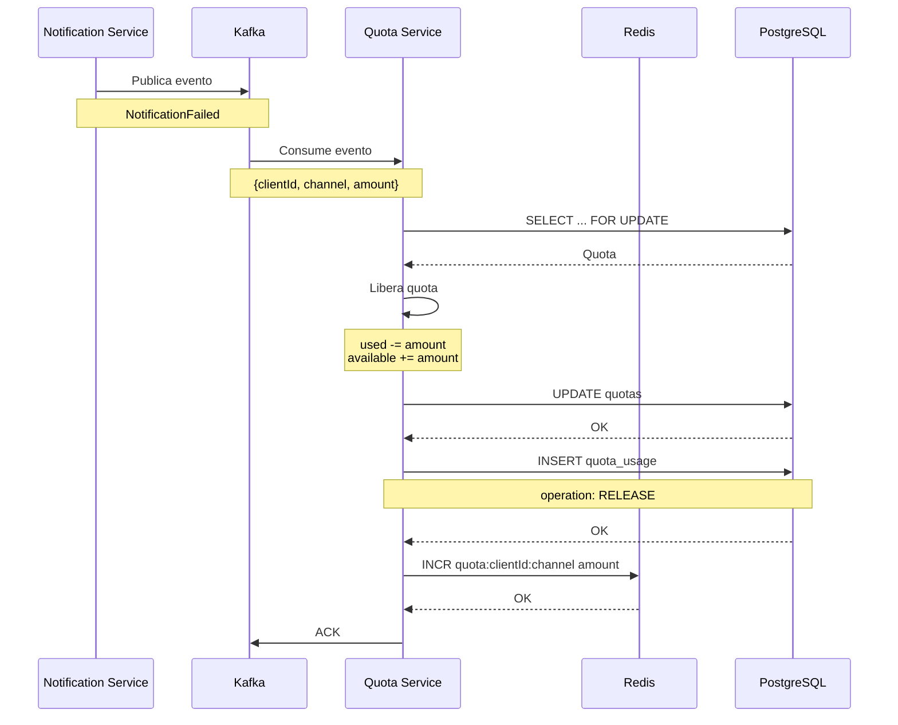
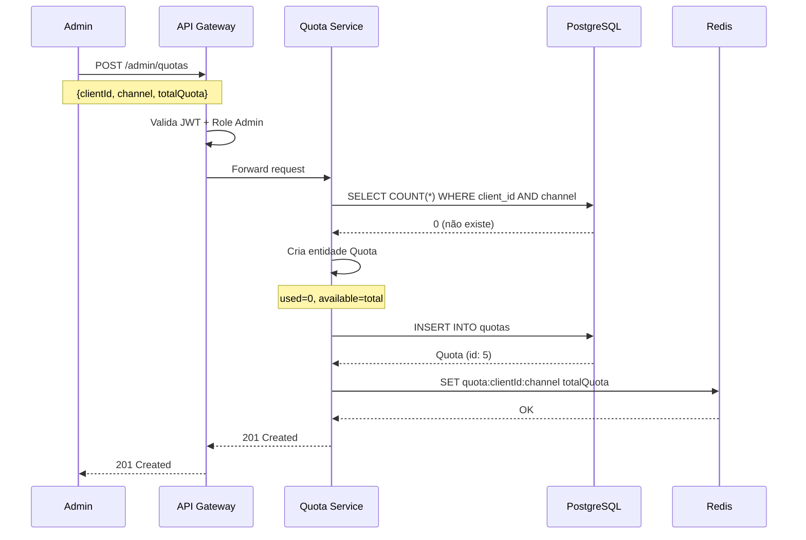
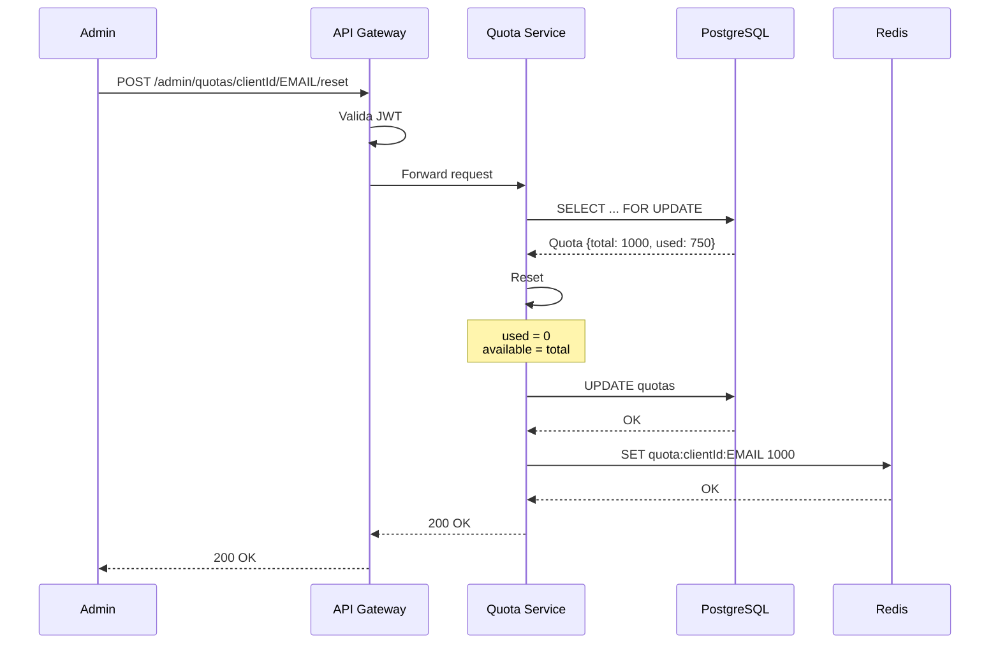

# Diagramas de Sequência - Quota Service

## 1. Validar e Consumir Quota (Sucesso)

---

## 2. Validar e Consumir Quota (Quota Excedida)

---

## 3. Consultar Quotas

---

## 4. Liberar Quota (Rollback)

---

## 5. Criar Nova Quota (Admin)

---

## 6. Reset de Quota

---

## Legenda

- **Cache HIT**: Quota encontrada no Redis (rápido)
- **Cache MISS**: Busca no PostgreSQL (mais lento)
- **Lock Pessimista**: `SELECT ... FOR UPDATE` previne race conditions
- **Auditoria**: Registro em `quota_usage` para histórico