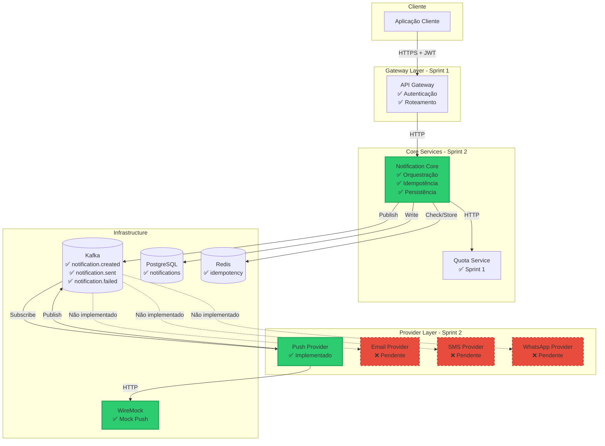

```mermaid
graph TB
    subgraph "Cliente"
        Client[Aplicação Cliente]
    end

subgraph "Gateway Layer - Sprint 1"
Gateway[API Gateway<br/>✅ Autenticação<br/>✅ Roteamento]
end

subgraph "Core Services - Sprint 2"
Core[Notification Core<br/>✅ Orquestração<br/>✅ Idempotência<br/>✅ Persistência]
Quota[Quota Service<br/>✅ Sprint 1]
end

subgraph "Provider Layer - Sprint 2"
Push[Push Provider<br/>✅ Implementado]
Email[Email Provider<br/>❌ Pendente]
SMS[SMS Provider<br/>❌ Pendente]
WA[WhatsApp Provider<br/>❌ Pendente]
end

subgraph "Infrastructure"
Kafka[(Kafka<br/>✅ notification.created<br/>✅ notification.sent<br/>✅ notification.failed)]
Postgres[(PostgreSQL<br/>✅ notifications)]
Redis[(Redis<br/>✅ idempotency)]
Mock[WireMock<br/>✅ Mock Push]
end

Client -->|HTTPS + JWT| Gateway
Gateway -->|HTTP| Core
Core -->|HTTP| Quota
Core -->|Write| Postgres
Core -->|Check/Store| Redis
Core -->|Publish| Kafka

Kafka -->|Subscribe| Push
Kafka -.->|Não implementado| Email
Kafka -.->|Não implementado| SMS
Kafka -.->|Não implementado| WA

Push -->|HTTP| Mock
Push -->|Publish| Kafka

style Core fill:#2ecc71,stroke:#27ae60,stroke-width:3px
style Push fill:#2ecc71,stroke:#27ae60,stroke-width:3px
style Mock fill:#2ecc71,stroke:#27ae60,stroke-width:3px
style Email fill:#e74c3c,stroke:#c0392b,stroke-width:2px,stroke-dasharray: 5 5
style SMS fill:#e74c3c,stroke:#c0392b,stroke-width:2px,stroke-dasharray: 5 5
style WA fill:#e74c3c,stroke:#c0392b,stroke-width:2px,stroke-dasharray: 5 5
```