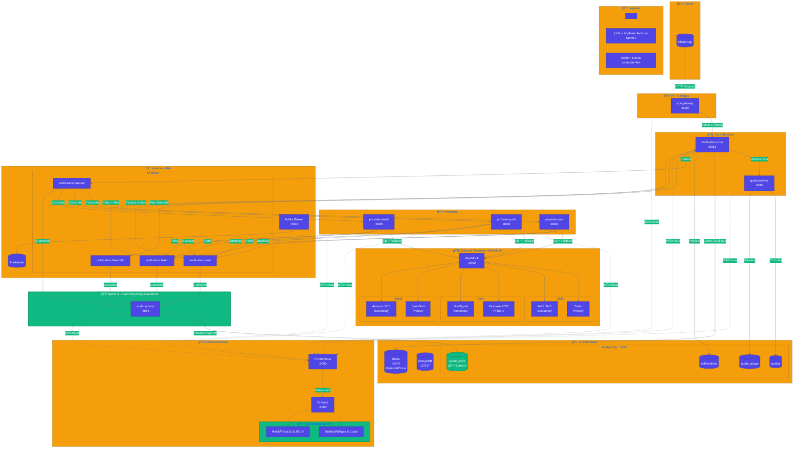

```mermaid

%%{init: {'theme': 'base', 'themeVariables': { 'primaryColor': '#4f46e5', 'primaryTextColor': '#fff', 'primaryBorderColor': '#3730a3', 'lineColor': '#6b7280', 'secondaryColor': '#10b981', 'tertiaryColor': '#f59e0b'}}}%%

graph TB
subgraph CLIENTS["👤 Clients"]
CLIENT[("Client App")]
end

    subgraph GATEWAY["🚪 API Gateway"]
        AG[api-gateway<br/>:8080]
    end

    subgraph CORE["🧠 Core Services"]
        NC[notification-core<br/>:8081]
        QS[quota-service<br/>:8082]
    end

    subgraph PROVIDERS["📤 Providers"]
        PS[provider-sms<br/>:8083]
        PP[provider-push<br/>:8084]
        PE[provider-email<br/>:8085]
    end

    subgraph SPRINT3["🆕 Sprint 3 - Event Sourcing & Auditoria"]
        style SPRINT3 fill:#10b981,stroke:#059669,stroke-width:3px,color:#fff
        AS[audit-service<br/>:8086]
    end

    subgraph KAFKA["📨 Apache Kafka"]
        ZK[(Zookeeper)]
        K[Kafka Broker<br/>:9092]
        
        subgraph TOPICS["Tópicos"]
            T1[notification.created]
            T2[notification.sent]
            T3[notification.failed]
            T4[notification.failed.dlq]
        end
    end

    subgraph DATABASES["ğŸ—„ï¸ Databases"]
        subgraph POSTGRES["PostgreSQL :5432"]
            TB_NOTIFICATIONS[(notifications)]
            TB_QUOTAS[(quotas)]
            TB_QUOTA_USAGE[(quota_usage)]
            TB_EVENT_STORE[("event_store<br/>🆕 Sprint 3")]
            style TB_EVENT_STORE fill:#10b981,stroke:#059669,stroke-width:2px
        end
        
        MONGO[(MongoDB<br/>:27017)]
        REDIS[(Redis<br/>:6379<br/>Idempotência)]
    end

    subgraph EXTERNAL["🌠External Providers (WireMock)"]
        WM[WireMock<br/>:9090]
        
        subgraph SMS_PROVIDERS["SMS"]
            SMS_P[Twilio<br/>Primary]
            SMS_S[AWS SNS<br/>Secondary]
        end
        
        subgraph PUSH_PROVIDERS["Push"]
            PUSH_P[Firebase FCM<br/>Primary]
            PUSH_S[OneSignal<br/>Secondary]
        end
        
        subgraph EMAIL_PROVIDERS["Email"]
            EMAIL_P[SendGrid<br/>Primary]
            EMAIL_S[Amazon SES<br/>Secondary]
        end
    end

    subgraph OBSERVABILITY["📊 Observabilidade"]
        PROM[Prometheus<br/>:9090]
        GRAF[Grafana<br/>:3000]
        
        subgraph DASHBOARDS["🆕 Dashboards Sprint 3"]
            style DASHBOARDS fill:#10b981,stroke:#059669,stroke-width:2px
            D1[Notificações & Custo]
            D2[Resiliência & SLI/SLO]
        end
    end

    %% Fluxo Principal
    CLIENT -->|HTTP Request| AG
    AG -->|Valida & Roteia| NC
    NC -->|Verifica Cota| QS
    QS -->|Consulta| TB_QUOTAS
    QS -->|Atualiza| TB_QUOTA_USAGE
    
    %% Idempotência
    NC -->|Check Duplicata| REDIS
    NC -->|Persiste| TB_NOTIFICATIONS
    
    %% Publicação Kafka
    NC -->|Publica| T1
    
    %% Consumers dos Providers
    T1 -->|Consome| PS
    T1 -->|Consome| PP
    T1 -->|Consome| PE
    
    %% Circuit Breaker + Fallback
    PS -->|"CB + Fallback"| WM
    PP -->|"CB + Fallback"| WM
    PE -->|"CB + Fallback"| WM
    
    WM --> SMS_P
    WM --> SMS_S
    WM --> PUSH_P
    WM --> PUSH_S
    WM --> EMAIL_P
    WM --> EMAIL_S
    
    %% Eventos de Retorno
    PS -->|Sucesso| T2
    PP -->|Sucesso| T2
    PE -->|Sucesso| T2
    
    PS -->|Falha| T3
    PP -->|Falha| T3
    PE -->|Falha| T3
    
    %% Retry & DLQ
    T3 -->|"Retry < Max"| NC
    NC -->|"Max Attempts"| T4
    
    %% Sprint 3: Event Sourcing
    T1 -->|Consome| AS
    T2 -->|Consome| AS
    T3 -->|Consome| AS
    T4 -->|Consome| AS
    AS -->|Persiste Eventos| TB_EVENT_STORE
    
    %% Core consome eventos de sucesso/falha
    T2 -->|Atualiza Status| NC
    
    %% Observabilidade
    NC -.->|Métricas| PROM
    QS -.->|Métricas| PROM
    PS -.->|Métricas| PROM
    PP -.->|Métricas| PROM
    PE -.->|Métricas| PROM
    AS -.->|Métricas| PROM
    AG -.->|Métricas| PROM
    
    PROM -->|Datasource| GRAF
    GRAF --> D1
    GRAF --> D2
    
    %% Kafka Infra
    K --> ZK

    %% Legenda
    subgraph LEGENDA["📋 Legenda"]
        L1[" "]
        L2["🆕 = Implementado na Sprint 3"]
        L3["Verde = Novos componentes"]
    end

```