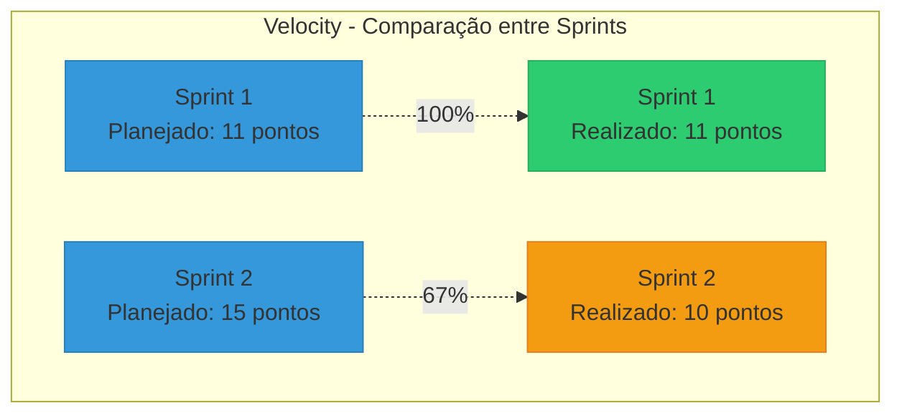

```mermaid
graph TB
    subgraph "Velocity - Comparação entre Sprints"
        S1P[Sprint 1<br/>Planejado: 11 pontos]
        S1R[Sprint 1<br/>Realizado: 11 pontos]
        S2P[Sprint 2<br/>Planejado: 15 pontos]
        S2R[Sprint 2<br/>Realizado: 10 pontos]
        
        S1P -.->|100%| S1R
        S2P -.->|67%| S2R
        
        style S1P fill:#3498db,stroke:#2980b9
        style S1R fill:#2ecc71,stroke:#27ae60
        style S2P fill:#3498db,stroke:#2980b9
        style S2R fill:#f39c12,stroke:#e67e22
    end
```